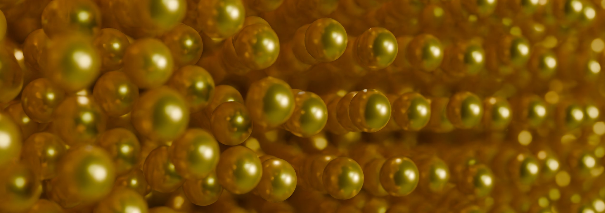

# Welcome!

Please find info about me and my work below! 
- [Research](research.md)
- [News](news.md)

## About Me
I am a researcher working on problems of soft condensed matter who is (most) interested by colloids and polymer networks. My favourate techniques include microscopy and scattering. Currently, I am looking for positions anywhere in the world! 

Check out my instagram below for some beautiful symmetric things I have found in the wild. 

## Contact and external links

Email: nicholasorrchem at gmail.com

Google Scholar: https://scholar.google.com/citations?user=J7uXIJIAAAAJ&hl=en

LinkedIn: [linkedin.com/in/nicholas-orr-190854331](https://www.linkedin.com/in/dr-nicholas-orr-190854331/)

Instagram: https://www.instagram.com/local_lattices/

---

This website is hosted on [GitHub Pages](https://pages.github.com/).

