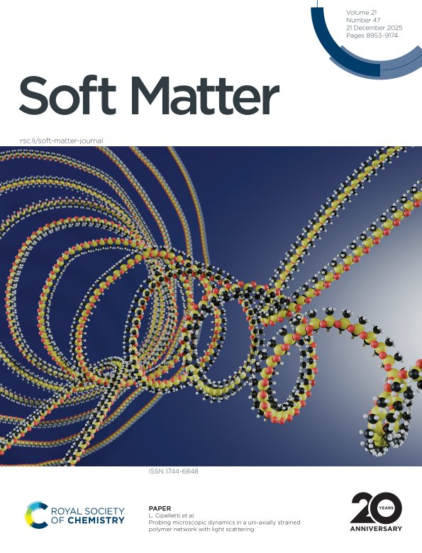
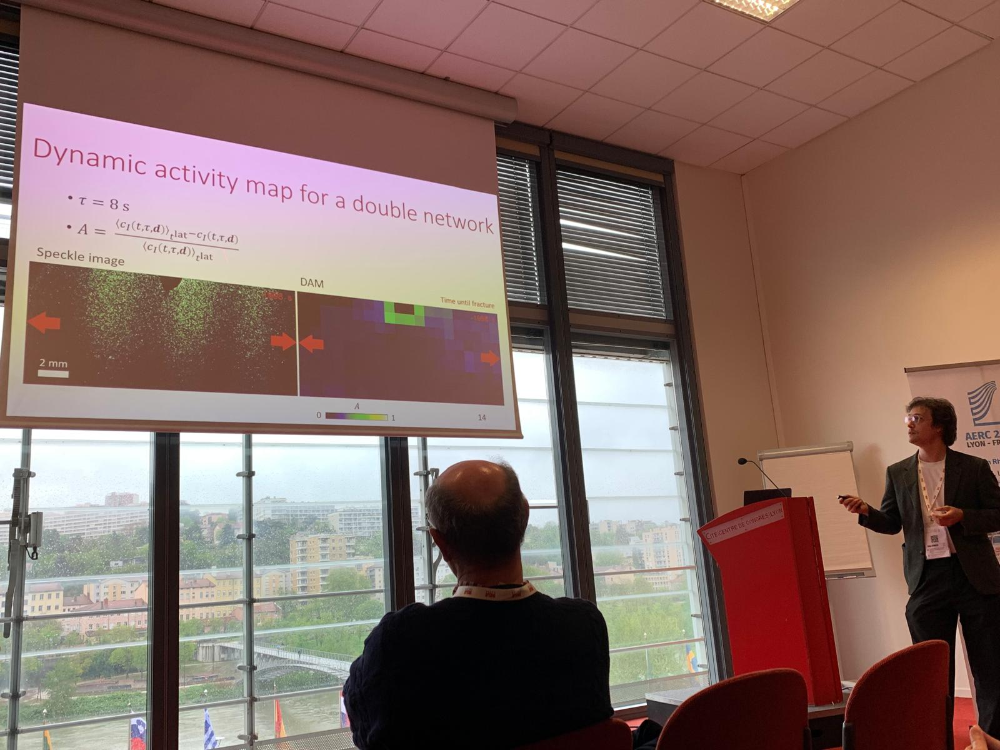

# News

## Publication in PNAS

2026 / 03 / 04 

I am very pleased to share that my postdoctoral work has been published in PNAS thanks to a years long collaboration between Laboratoire Charles Coulomb Montpellier, LIPhy Grenoble and ESPCI Paris. We used both experiments and simulations to examine the emergent toughness of multiple polymer networks at a microscopic level. Learn more about it at the link below! Thank you to everyone who made this work possible!

Find the article at PNAS here: https://lnkd.in/epXtgTSs

## Soft Matter Cover 

2025 / 12 / 21. Our work on microscopic motion in polymer networks is featured on the front cover of Soft Matter. I designed the cover artwork! 
  
https://pubs.rsc.org/en/content/articlelanding/2025/sm/d5sm00865d 

[Back to Home](index.md)

## Talk at AERC Lyon 2025
2025 / 04 / 17. Sharing our work about fracture in multiple polymer networks at the Annual European Rheology Conference in Lyon.

[Back to Home](index.md)
