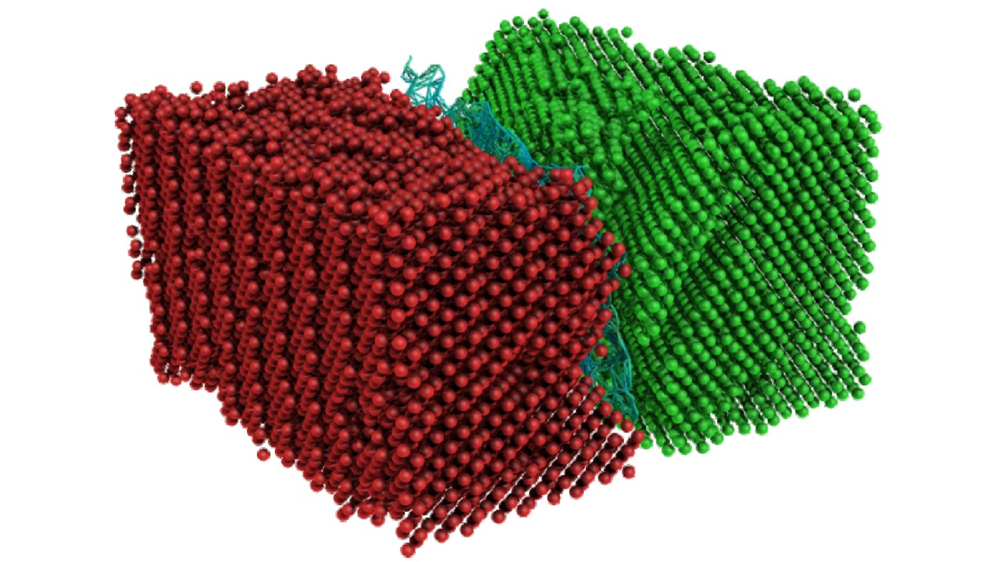
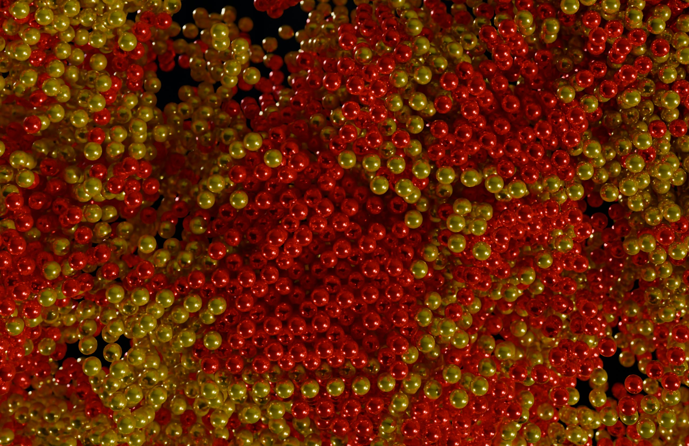
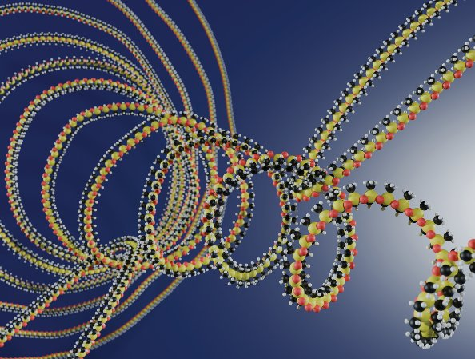

# Research

## Anti-counterfeit solutions from 2D colloidal crystals

To tackle the prevalent problem of counterfeit we are developing physically unclonable markers made of 2D colloidal crystals (see the image below which contains several crystals). The big idea is that even though we follow the same synthesis steps each time, the pattern of grains and grain boundaries that we create is different for each crystal, and thus unclonable. This is similar in spirit to how every snowflake has a different shape.

However, the beauty here is that each colloidal crystal grain produces structural colour from the interaction of the micrometric lattice of colloidal beads and visible light. What results is a patchwork of colours that is visible with simple optics, like those found in a phone camera, allowing easy access to the unique grain structure. Through analysis of the structure and comparison to a database of known crystals, the authenticity and provenance of a linked product can be ensured.

[Back to Home](index.md)

---

## Measuring and controlling crystal structure

I have developed a tool called BLoSSOM for finding Boundaries, Location, Symmetry, Structure, Orientation and Misorientation from particle coordinates. It is particularly powerful to examine disorder within crystals. The image below shows an example of crystal structure and grain boundary analysis within a colloidal bicrystal.

  
Read more about the work here:
  
https://journals.aps.org/prmaterials/abstract/10.1103/PhysRevMaterials.5.123605

In another project, we showed that crystallisation can be controlled so that large monodomains of colloidal crystals can be produced under shear. We also uncovered the mechanism where hexagonal planes of particles form before the planes organise amongst themselves.

  
Read more about it here:
  
https://pubs.aip.org/aip/jcp/article/157/22/224903/2842704/Single-orientation-colloidal-crystals-from

  
Currently, we are considering how hard sphere colloidal particles crystallise. An experimental snapshot of our experiments is shown below.

[Back to Home](index.md)

---

## Microscopic motion in polymer networks

We developed an optically and rheology-coupled dynamic light scattering apparatus to measure the microscopic motion during polymer network deformation. This work was featured on the front cover of the journal Soft Matter, the artwork for which I made and is shown below. It features an entangled PDMS polymer being stretched and unravelled as we discuss in the paper.

  
Read more here:
  
https://pubs.rsc.org/en/content/articlelanding/2025/sm/d5sm00865d

In continuation, we used simulations and this apparatus mentioned above to examine the difference in motion in single polymer networks and in interpenetrated (double) polymer networks.

[Back to Home](index.md)
